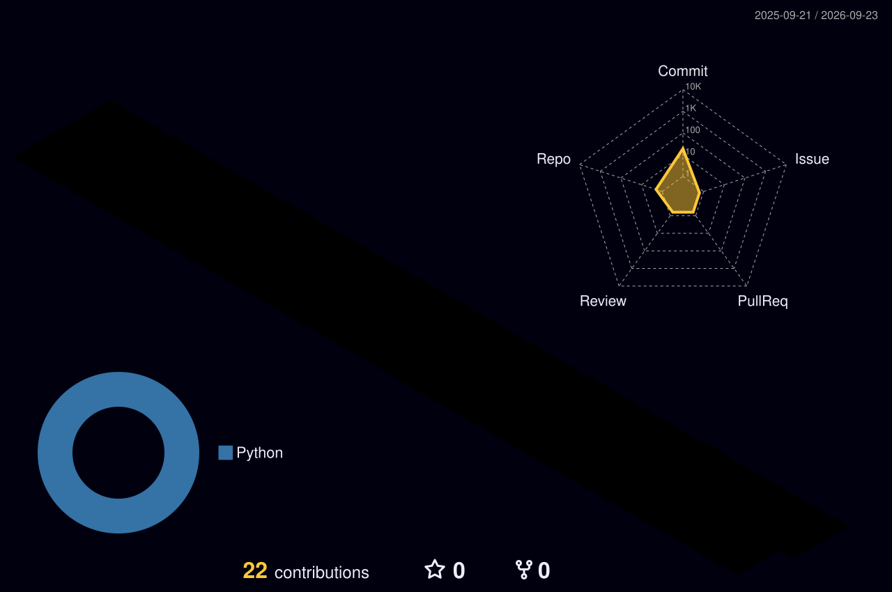

 

 

## 📌 About Me

- 🎓 CS undergrad, Batch 2025–2029 — Ramakrishna Mission Vidyamandira (Belur Math), University of Kalyani
- 🔐 Built a custom **SSO (Single Sign-On)** system from scratch — IdP/SP design, OpenID Connect-style auth code flow, JWT (RS256) signing, Flask + SQLAlchemy
- 🛒 Built **Endeavour**, an ecommerce website
- 🏫 Current developer of **RKMVMFamily**, my college's official website
- 🕵️ Currently working on data privacy topics (DPDP India, GDPR, CCPA/CPRA, HIPAA)
- 📄 Also comfortable with MS Excel and MS Word for reporting/documentation work

 

## 🛠️ Tech Stack

**Languages**

**Frameworks & Libraries**

**Tools**

 

## 📂 Featured Projects

<table>
<tr>
<td width="50%">

**🔐 SSO System**
Custom Single Sign-On built from scratch for a multi-product company — IdP/SP architecture, OpenID Connect-style auth code flow, JWT (RS256) signing.
`Flask` `SQLAlchemy` `JWT`

</td>
<td width="50%">

**🛒 Endeavour**
Ecommerce website.
`HTML` `CSS` `JavaScript`

</td>
</tr>
<tr>
<td width="50%">

**🏫 RKMVMFamily**
Official website of my college — in active development.
`Web Development`

</td>
<td width="50%">

**🕵️ Data Privacy Research**
Compliance-focused work covering DPDP India, GDPR, CCPA/CPRA, HIPAA.
`Research` `Documentation`

</td>
</tr>
</table>

 

## 📊 GitHub Stats

 

## 🌐 3D Contribution Graph

<!--
  This section is populated automatically by the GitHub Action in
  .github/workflows/profile-3d-contrib.yml — it runs daily and commits
  fresh SVGs into a profile-3d-contrib/ folder. The lines below are the
  standard file names that action produces; nothing to edit once the
  workflow has run once.
-->

 

