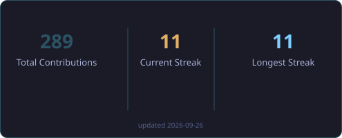
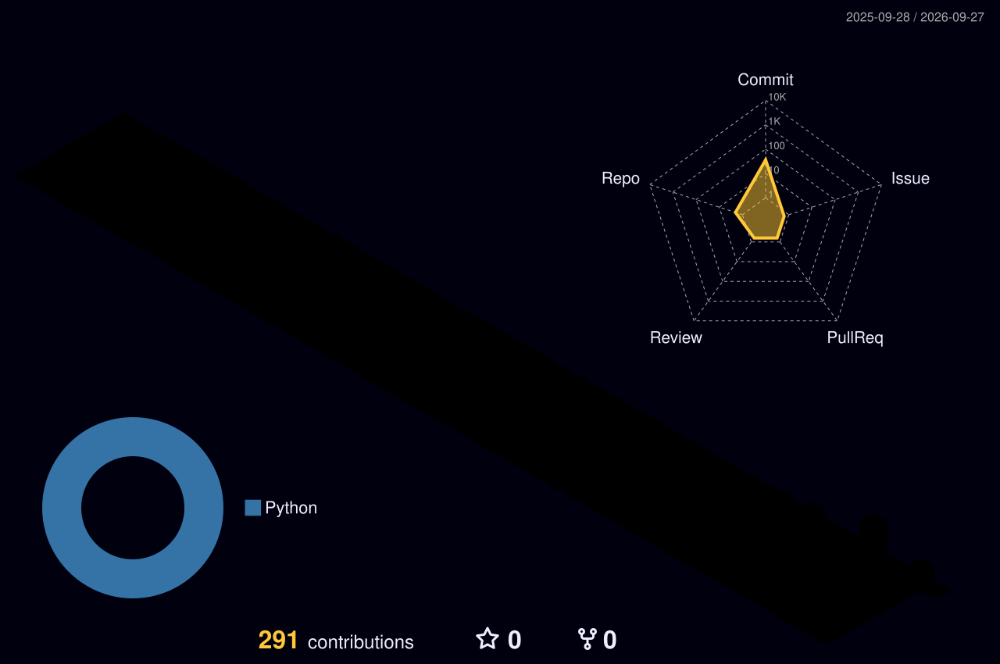

&nbsp;

## About

Computer Science undergraduate (Batch 2025–2029) at Ramakrishna Mission Vidyamandira, Belur Math, affiliated with the University of Kalyani. I work mainly on backend systems and authentication — most recently a Single Sign-On service built from scratch — and I'm currently developing my college's official website. Alongside that, I'm studying data privacy frameworks (DPDP India, GDPR, CCPA/CPRA, HIPAA).

&nbsp;

## Tech Stack

<!-- SKILLS:START -->

<!-- SKILLS:END -->

*(This section updates itself — see "Keeping this fresh" below.)*

&nbsp;

## Featured Projects

<table>
<tr>
<td width="50%" valign="top">
<h3>🔐 SSO System</h3>
Custom Single Sign-On built from scratch for a multi-product company — IdP/SP architecture, OpenID Connect-style auth code flow, JWT (RS256) signing.
  
<code>Flask</code> <code>SQLAlchemy</code> <code>JWT</code>
</td>
<td width="50%" valign="top">
<h3>🛒 Endeavour</h3>
An ecommerce website.
  
<code>HTML</code> <code>CSS</code> <code>JavaScript</code>
</td>
</tr>
<tr>
<td width="50%" valign="top">
<h3>🏫 RKMVMFamily</h3>
Official website of my college — currently in active development.
  
<code>Web Development</code>
</td>
<td width="50%" valign="top">
<h3>🔎 Data Privacy Research</h3>
Ongoing study of compliance frameworks — DPDP India, GDPR, CCPA/CPRA, HIPAA.
  
<code>Research</code> <code>Documentation</code>
</td>
</tr>
</table>

&nbsp;

## GitHub Stats

&nbsp;

## 3D Contribution Graph

&nbsp;

## Keeping this fresh

Two GitHub Actions do the automatic updates, no manual README edits required:

| Workflow | What it does | How to trigger it |
|---|---|---|
| `update-skills.yml` | Scans every public repo's language + topics and rebuilds the **Tech Stack** badges above | Runs daily, or add a topic to any repo (e.g. `docker`, `node`) and re-run it manually |
| `profile-3d-contrib.yml` | Regenerates the 3D contribution graph from your commit activity | Runs daily automatically |

**To add a new skill:** open any repo → Settings → add a topic (e.g. `node`, `docker`, `postgresql`) → the next scheduled run (or a manual "Run workflow" click in the Actions tab) picks it up and adds the badge. No need to touch this file by hand.

